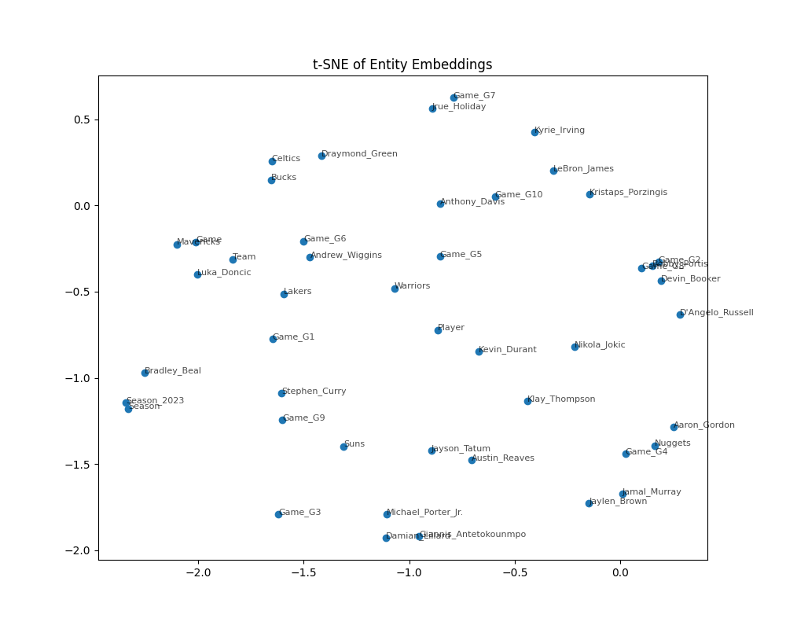

# Basketball Knowledge Graph with Reasoning, KGE, and RAG QA

This project implements a full pipeline for a Semantic Web application:
1. **Data Acquisition & IE**: Crawling, cleaning, and NER (implemented in `src/kg/build_kg.py`).
2. **KB Construction**: RDF graph, ontology, and entity alignment.
3. **Reasoning**: SWRL rules for teammates and scoring against opponents.
4. **KGE**: TransE and DistMult embeddings for link prediction.
5. **RAG**: Natural Language to SPARQL with self-repair using Ollama.

## 🚀 Installation

### 1. Requirements
- Python 3.10+
- [Ollama](https://ollama.com/) (for RAG)

### 2. Setup Environment
```bash
python -m venv venv
source venv/bin/activate
pip install -r requirements.txt
```

### 3. Install Ollama & Llama3
```bash
# Install Ollama from ollama.com
ollama pull llama3
```

## 🛠️ How to Run

### 1. Build Knowledge Graph
```bash
python src/kg/build_kg.py
python src/kg/align_kg.py
```
Outputs: `kg_artifacts/ontology.ttl`, `kg_artifacts/alignment.ttl`, `kg_artifacts/expanded.nt`.

### 2. Run SWRL Reasoning (OWLready2)
```bash
python src/reason/swrl_reasoning.py
```
Output: `kg_artifacts/basketball_reasoned.owl` (contains inferred triples).

### 3. Train KGE Models (PyKEEN)
```bash
python src/kge/train_kge.py
```
Outputs split files in `data/kge_datasets/` and t-SNE plot in `reports/tsne_transe.png`.

### 4. Run RAG Demo
Ensure Ollama is running (`ollama serve`).
```bash
python src/rag/rag_pipeline.py
```

## 📊 Hardware Requirements
- CPU: 4+ cores
- RAM: 8GB minimum
- GPU: Optional (PyKEEN detects CUDA/MPS automatically)

## 📷 Screenshots


## 📁 Repository Structure
```
project-root/
├─ src/
│  ├─ kg/         # KG Construction & Alignment
│  ├─ reason/     # SWRL reasoning rules
│  ├─ kge/        # Embeddings & Training
│  └─ rag/        # RAG pipeline
├─ data/          # CSV & KGE splits
├─ kg_artifacts/  # RDF/TTL/OWL files
├─ reports/       # Report and Plots
├─ requirements.txt
├─ README.md
```